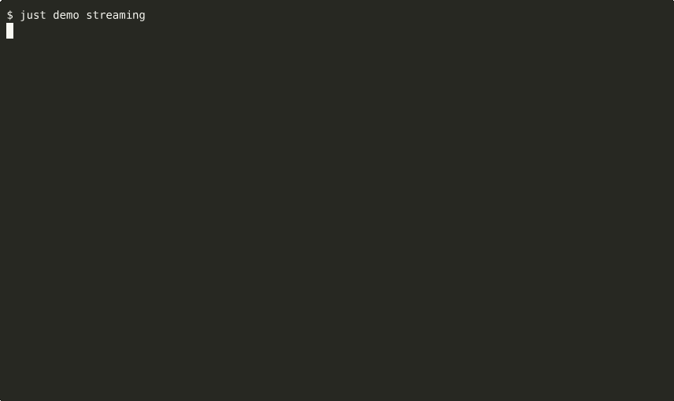

<p align="center">
  
</p>
<h1 align="center">Claude Code Go SDK</h1>
<p align="center">
  <a href="https://github.com/lancekrogers/claude-code-go/actions/workflows/ci.yml"></a>
  <a href="https://pkg.go.dev/github.com/lancekrogers/claude-code-go"></a>
</p>

A comprehensive Go library for programmatically integrating the Claude Code CLI into Go applications. Build AI-powered coding assistants, automated workflows, and intelligent agents on top of Claude Code's non-interactive `-p/--print` surface.

First Claude Code SDK, released before any official SDKs existed.

This SDK intentionally wraps the prompt-oriented `claude -p` workflow. Interactive sessions and management subcommands such as `auth`, `mcp`, `plugins`, `install`, and `update` remain out of scope.

## Highlights

- Current `claude -p` wrapper with text/json/stream-json outputs
- Streaming, sessions (resume/fork), and context-aware APIs
- MCP integration with fine-grained tool permissions
- Current prompt flags including agents, effort, settings, tools, and budget controls
- Subagents, plugins, retries, and budget tracking for production workflows
- 9 interactive demos and comprehensive tests

## Features

### Core Capabilities

- **Prompt Surface Wrapper**: Accurate coverage of the current non-interactive `claude -p` flag surface
- **Streaming Support**: Real-time response streaming with context cancellation
- **Session Management**: Multi-turn conversations with custom IDs, forking, and persistence control
- **MCP Integration**: Model Context Protocol support for extending Claude with external tools

### Advanced Features

- **Plugin System**: Extensible architecture with logging, metrics, audit, and tool filtering plugins
- **Budget Tracking**: Cost control with spending limits, warnings, and callbacks
- **Subagent Orchestration**: Specialized agents for different tasks (security, code review, testing)
- **Retry & Error Handling**: Configurable retry policies with exponential backoff and jitter
- **Permission Control**: Fine-grained tool permissions with allowlists, blocklists, and modes

### Developer Experience

- **9 Interactive Demos**: Ready-to-run examples showcasing core workflows
- **Comprehensive Testing**: Unit and integration tests with mock server support
- **Multiple Output Formats**: Text, JSON, and streaming JSON outputs

## Installation

```bash
go get github.com/lancekrogers/claude-code-go
```

## Quick Start

```go
package main

import (
    "fmt"
    "log"

    "github.com/lancekrogers/claude-code-go/pkg/claude"
)

func main() {
    cc := claude.NewClient("claude")

    result, err := cc.RunPrompt("Write a function to calculate Fibonacci numbers", nil)
    if err != nil {
        log.Fatalf("Error: %v", err)
    }

    fmt.Println(result.Result)
}
```

## Prerequisites

- **Claude Max Subscription**: Required for Claude Code CLI
  - [Sign up for Claude Max](https://claude.ai/referral/UKHPp7nGJw)
- **Claude Code CLI**: Installed and accessible in PATH

## Interactive Demos



See [docs/DEMOS.md](docs/DEMOS.md) for the full list, GIFs, and run commands.

```bash
# Core demos
just demo streaming    # Real-time streaming (default)
just demo basic        # Basic JSON output

# Feature demos
just demo sessions     # Session management and forking
just demo mcp          # MCP server integration
just demo retry        # Retry and error handling
just demo permissions  # Permission control system
just demo budget       # Budget tracking with spending limits
just demo plugins      # Plugin system with logging/metrics
just demo subagents    # Multi-agent orchestration
```

## Core Features

### Basic Usage

```go
cc := claude.NewClient("claude")

// Simple prompt
result, err := cc.RunPrompt("Generate a hello world function", &claude.RunOptions{
    Format: claude.JSONOutput,
})

// With custom system prompt
result, err = cc.RunWithSystemPrompt(
    "Create a database schema",
    "You are a database architect. Use PostgreSQL best practices.",
    nil,
)
```

### Streaming Responses

```go
ctx := context.Background()
messageCh, errCh := cc.StreamPrompt(ctx, "Build a React component", &claude.RunOptions{})

go func() {
    for err := range errCh {
        log.Printf("Error: %v", err)
    }
}()

for msg := range messageCh {
    switch msg.Type {
    case "assistant":
        fmt.Println("Claude:", msg.Result)
    case "result":
        fmt.Printf("Done! Cost: $%.4f\n", msg.CostUSD)
    }
}
```

### Session Management

```go
// Generate a custom session ID
sessionID := claude.GenerateSessionID()

// Start a new session with custom ID
result, err := cc.RunPrompt("Write a fibonacci function", &claude.RunOptions{
    SessionID: sessionID,
    Format:    claude.JSONOutput,
})

// Resume the conversation
followup, err := cc.ResumeConversation("Now optimize it for performance", result.SessionID)

// Fork a session (create a branch)
forked, err := cc.RunPrompt("Try a different approach", &claude.RunOptions{
    ResumeID:    result.SessionID,
    ForkSession: true,
})

// Ephemeral session (no disk persistence)
ephemeral, err := cc.RunPrompt("Quick question", &claude.RunOptions{
    NoSessionPersistence: true,
})
```

### MCP Integration

```go
// Single MCP config
result, err := cc.RunWithMCP(
    "List files in the project",
    "mcp-config.json",
    []string{"mcp__filesystem__list_directory"},
)

// Multiple MCP configs
result, err = cc.RunWithMCPConfigs("Use both tools", []string{
    "filesystem-mcp.json",
    "database-mcp.json",
}, nil)

// Strict mode (only use specified MCP servers)
result, err = cc.RunWithStrictMCP("Isolated environment", []string{
    "secure-mcp.json",
}, nil)
```

## Advanced Features

### Plugin System

```go
// Create plugin manager
pm := claude.NewPluginManager()

// Add logging plugin
logger := claude.NewLoggingPlugin(log.Printf)
logger.SanitizeSecrets = true  // Redact API keys, tokens, etc.
logger.TruncateLength = 500    // Limit log output
pm.Register(logger, nil)

// Add metrics plugin
metrics := claude.NewMetricsPlugin()
pm.Register(metrics, nil)

// Add tool filter (block dangerous tools)
filter := claude.NewToolFilterPlugin(map[string]string{
    "Bash(rm*)": "Deletion commands blocked",
})
pm.Register(filter, nil)

// Add audit plugin
audit := claude.NewAuditPlugin(1000) // Keep last 1000 records
pm.Register(audit, nil)

ctx := context.Background()
if err := pm.Initialize(ctx); err != nil {
    log.Fatal(err)
}
defer pm.Shutdown(ctx)

// Use with client
result, err := cc.RunPromptCtx(ctx, "Do something", &claude.RunOptions{
    PluginManager: pm,
})

// Get metrics
stats := metrics.GetMetrics()
fmt.Printf("Total cost: $%.4f\n", stats["total_cost"])

// Get audit records
records := audit.GetRecords()
```

### Budget Tracking

```go
// Create budget tracker with callbacks
tracker := claude.NewBudgetTracker(&claude.BudgetConfig{
    MaxBudgetUSD:     10.00, // $10 limit
    WarningThreshold: 0.8,   // Warn at 80%
    OnBudgetWarning: func(current, max float64) {
        fmt.Printf("Warning: Budget at %.0f%%\n", (current/max)*100)
    },
    OnBudgetExceeded: func(current, max float64) {
        fmt.Printf("Budget exceeded: $%.2f > $%.2f\n", current, max)
    },
})

// Use with client
result, err := cc.RunPrompt("Generate code", &claude.RunOptions{
    MaxBudgetUSD:  10.00,
    BudgetTracker: tracker,
})

// Check budget status
fmt.Printf("Spent: $%.4f, Remaining: $%.4f\n",
    tracker.TotalSpent(), tracker.RemainingBudget())
```

### Subagent Orchestration

```go
// Define specialized agents
agents := map[string]*claude.SubagentConfig{
    "security": {
        Description: "Security analysis and vulnerability detection",
        Prompt:      "You are a security expert. Analyze code for vulnerabilities.",
        Tools:       []string{"Read(*)", "Grep(*)"},
        Model:       "opus",
    },
    "testing": {
        Description: "Test generation and coverage analysis",
        Prompt:      "You are a testing expert. Generate comprehensive tests.",
        Tools:       []string{"Read(*)", "Write(*)", "Bash(go test*)"},
    },
}

// Define agents and select one for this run
result, err := cc.RunPrompt("Analyze this code", &claude.RunOptions{
    Agent:  "security",
    Agents: agents,
})
```

### Retry & Error Handling

```go
// Custom retry policy
policy := &claude.RetryPolicy{
    MaxRetries:    5,
    BaseDelay:     100 * time.Millisecond,
    MaxDelay:      10 * time.Second,
    BackoffFactor: 2.0,
}

// With automatic retry
result, err := cc.RunPromptWithRetry("Do something", nil, policy)

// With timeout
ctx, cancel := context.WithTimeout(context.Background(), 30*time.Second)
defer cancel()

result, err = cc.RunPromptCtx(ctx, "Quick task", &claude.RunOptions{
    Timeout: 30 * time.Second,
})

// Error classification
if err != nil {
    if claudeErr, ok := err.(*claude.ClaudeError); ok {
        if claudeErr.IsRetryable() {
            // Handle retryable error
        }
        fmt.Printf("Error type: %s\n", claudeErr.Type)
    }
}
```

### Permission Control

```go
// Permission modes
result, err := cc.RunPrompt("Edit files", &claude.RunOptions{
    PermissionMode: claude.PermissionModeAcceptEdits, // Auto-approve edits
})

// Tool allowlisting (with glob patterns)
result, err = cc.RunPrompt("Work with git", &claude.RunOptions{
    AllowedTools: []string{
        "Read(*)",
        "Bash(git status*)",
        "Bash(git log*)",
        "Bash(git diff*)",
    },
})

// Tool blocklisting
result, err = cc.RunPrompt("Safe operations only", &claude.RunOptions{
    DisallowedTools: []string{
        "Bash(rm*)",
        "Bash(curl*)",
        "Write(*)",
    },
})
```

## API Reference

### RunOptions

```go
type RunOptions struct {
    // Output format
    Format      OutputFormat // text, json, stream-json
    InputFormat InputFormat  // text, stream-json (stdin with --print)

    // Prompts
    SystemPrompt string        // Override default system prompt
    AppendPrompt string        // Append to default system prompt

    // Session control
    SessionID            string // Custom session UUID
    ResumeID             string // Resume existing session
    Continue             bool   // Continue most recent conversation
    ForkSession          bool   // Fork from resumed session
    NoSessionPersistence bool   // Don't save to disk

    // Agent selection
    Agent      string                      // Select a named agent for this run
    Agents     map[string]*SubagentConfig  // Inline agent definitions for --agents
    AgentsJSON string                      // Raw JSON passed directly to --agents

    // MCP configuration
    MCPConfigPath   string   // Single MCP config path
    MCPConfigs      []string // Multiple MCP configs
    StrictMCPConfig bool     // Only use specified MCP servers

    // Tool permissions
    AllowedTools    []string       // Tools Claude can use
    DisallowedTools []string       // Tools Claude cannot use
    PermissionMode  PermissionMode // default, acceptEdits, auto, bypassPermissions, dontAsk, plan

    // Model selection
    Model      string      // Full model name
    ModelAlias string      // sonnet, opus, haiku
    Effort     EffortLevel // low, medium, high, xhigh, max

    // CLI prompt surface
    MaxBudgetUSD                  float64
    Settings                      string
    SettingSources                []string
    Tools                         []string
    Name                          string
    PluginDirs                    []string
    Bare                          bool
    Brief                         bool
    Betas                         []string
    Files                         []string
    Debug                         string
    DebugFile                     string
    IncludeHookEvents             bool
    IncludePartialMessages        bool
    ReplayUserMessages            bool
    ExcludeDynamicSystemPromptSections bool
    AllowDangerouslySkipPermissions bool
    Timeout                       time.Duration

    // Lifecycle extensions
    BudgetTracker *BudgetTracker // Shared tracker
    PluginManager *PluginManager // Plugin hooks
}
```

Deprecated compatibility fields remain in `RunOptions` for now, but the SDK no longer emits removed CLI flags such as `--max-turns`, `--config`, `--disable-autoupdate`, `--theme`, or `--permission-prompt-tool`.

### Core Methods

```go
// Basic execution
func (c *ClaudeClient) RunPrompt(prompt string, opts *RunOptions) (*ClaudeResult, error)
func (c *ClaudeClient) RunPromptCtx(ctx context.Context, prompt string, opts *RunOptions) (*ClaudeResult, error)

// Streaming
func (c *ClaudeClient) StreamPrompt(ctx context.Context, prompt string, opts *RunOptions) (<-chan Message, <-chan error)

// Stdin processing
func (c *ClaudeClient) RunFromStdin(stdin io.Reader, prompt string, opts *RunOptions) (*ClaudeResult, error)

// With retry
func (c *ClaudeClient) RunPromptWithRetry(prompt string, opts *RunOptions, policy *RetryPolicy) (*ClaudeResult, error)

// Session convenience
func (c *ClaudeClient) ContinueConversation(prompt string) (*ClaudeResult, error)
func (c *ClaudeClient) ResumeConversation(prompt, sessionID string) (*ClaudeResult, error)

// MCP convenience
func (c *ClaudeClient) RunWithMCP(prompt, configPath string, tools []string) (*ClaudeResult, error)
func (c *ClaudeClient) RunWithMCPConfigs(prompt string, configs []string, opts *RunOptions) (*ClaudeResult, error)
func (c *ClaudeClient) RunWithStrictMCP(prompt string, configs []string, opts *RunOptions) (*ClaudeResult, error)
```

## Security-Sensitive Features

For advanced use cases requiring bypassed safety controls:

```go
import "github.com/lancekrogers/claude-code-go/pkg/claude/dangerous"

// SECURITY REVIEW REQUIRED
cc, err := dangerous.NewDangerousClient("claude")
if err != nil {
    // Fails unless CLAUDE_ENABLE_DANGEROUS="i-accept-all-risks"
    return err
}

// Bypass all permission prompts
result, err := cc.BYPASS_ALL_PERMISSIONS("trusted prompt", nil)
```

**Requirements:**

- Set `CLAUDE_ENABLE_DANGEROUS="i-accept-all-risks"`
- Cannot run in production environments
- See [pkg/claude/dangerous/README.md](pkg/claude/dangerous/README.md)

## Testing

```bash
# All tests
just test all

# Unit tests only
just test lib

# Integration tests (mock server)
just test integration

# Coverage report
just coverage
```

## Development

[Just](https://github.com/casey/just) is the primary command runner:

```bash
# Show available commands
just --list

# Build everything
just build all

# Run linting
just lint
```

## Documentation

- [docs/DEMOS.md](docs/DEMOS.md)
- [docs/CONTRIBUTING.md](docs/CONTRIBUTING.md)
- [docs/PROMPT_SURFACE_NOTES_0.1.1.md](docs/PROMPT_SURFACE_NOTES_0.1.1.md)

## Contributing

See [docs/CONTRIBUTING.md](docs/CONTRIBUTING.md) for guidelines.

## License

MIT License - see LICENSE file.

## Acknowledgments

- Anthropic for creating Claude Code
- The Go community for excellent tooling
