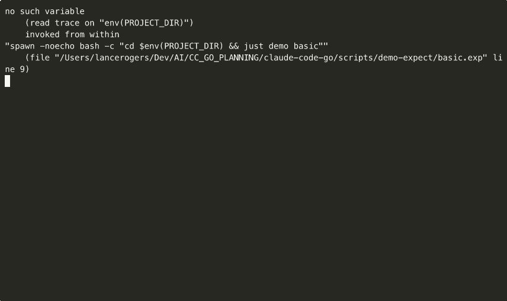

# Claude Code Go SDK - Interactive Demos

This document showcases the interactive demos included with the Claude Code Go SDK. Each demo highlights a specific feature of the SDK with animated GIFs showing the functionality in action.

## Quick Start

```bash
# Install dependencies for GIF generation (optional)
brew install asciinema
cargo install --git https://github.com/asciinema/agg

# Build all demos
just build all

# Run a specific demo
just demo streaming
just demo basic
just demo sessions
# ... etc
```

## Available Demos

| Demo | Description | Run Command |
|------|-------------|-------------|
| [Basic](#basic) | Fundamental SDK usage patterns | `just demo basic` |
| [Streaming](#streaming) | Real-time message streaming | `just demo streaming` |
| [Sessions](#sessions) | Session management and forking | `just demo sessions` |
| [MCP](#mcp) | Model Context Protocol integration | `just demo mcp` |
| [Retry](#retry) | Automatic retry with backoff | `just demo retry` |
| [Permissions](#permissions) | Tool access control | `just demo permissions` |
| [Budget](#budget) | Cost tracking and limits | `just demo budget` |
| [Plugins](#plugins) | Plugin system extensibility | `just demo plugins` |
| [Subagents](#subagents) | Agent orchestration | `just demo subagents` |

---

## Basic

**Fundamental SDK usage patterns**

The basic demo shows how to create a Claude client, run prompts, and handle responses with structured output.



**Key Features:**
- Creating a Claude client
- Running simple prompts
- Configuring RunOptions
- Accessing structured results

**Run it:** `just demo basic`

---

## Streaming

**Real-time message streaming**

Stream responses as they're generated for responsive applications. Handle different message types and implement graceful cancellation.


**Key Features:**
- StreamPrompt for real-time responses
- Message type handling (system, assistant, result)
- Error channel processing
- Context cancellation support

**Run it:** `just demo streaming`

---

## Sessions

**Session management and conversation forking**

Manage multi-turn conversations with explicit session IDs. Fork conversations to explore alternative paths while preserving the original.


**Key Features:**
- Explicit session ID management
- Resume previous conversations
- Fork sessions for branching
- Ephemeral (non-persisted) sessions

**Run it:** `just demo sessions`

---

## MCP

**Model Context Protocol integration**

Extend Claude's capabilities with MCP servers. Configure HTTP, SSE, and Stdio servers for external tool integration.


**Key Features:**
- MCPConfigBuilder fluent API
- HTTP, SSE, and Stdio server types
- Environment variable injection
- Multiple config file support

**Run it:** `just demo mcp`

---

## Retry

**Automatic retry with exponential backoff**

Handle transient failures gracefully with configurable retry policies. Exponential backoff with jitter prevents thundering herd problems.


**Key Features:**
- Configurable retry attempts
- Exponential backoff
- Jitter for distributed systems
- Retryable error detection

**Run it:** `just demo retry`

---

## Permissions

**Fine-grained tool access control**

Control which tools Claude can use with permission modes, whitelists, and custom callbacks. Essential for production security.


**Key Features:**
- Permission modes (Default, AcceptEdits, Bypass)
- AllowedTools and DisallowedTools lists
- Pre-built callbacks (ReadOnly, SafeBash, FilePath)
- Custom permission callbacks

**Run it:** `just demo permissions`

---

## Budget

**Cost tracking and budget limits**

Track API costs across requests and enforce spending limits. Essential for cost-conscious production deployments.


**Key Features:**
- Per-request budget limits (MaxBudgetUSD)
- Shared BudgetTracker across requests
- Real-time cost monitoring
- Budget exceeded detection

**Run it:** `just demo budget`

---

## Plugins

**Plugin system extensibility**

Extend SDK behavior with plugins for logging, metrics, filtering, and auditing. Create custom plugins for specialized needs.


**Key Features:**
- Built-in plugins (Logging, Metrics, ToolFilter, Audit)
- Plugin lifecycle hooks (BeforeRun, AfterRun)
- Plugin manager for enable/disable
- Custom plugin interface

**Run it:** `just demo plugins`

---

## Subagents

**Agent orchestration for complex tasks**

Orchestrate specialized AI agents for complex multi-step tasks. Decompose work into exploration, planning, and execution phases.


**Key Features:**
- Subagent types (Explore, Plan, Code, Review)
- Task decomposition patterns
- Agent orchestration workflows
- Parallel execution support

**Run it:** `just demo subagents`

---

## Generating Demo GIFs

To regenerate the demo GIFs:

```bash
# Generate a single demo GIF
just demo gif basic

# Generate all demo GIFs
just demo gif-all

# List available demos
just demo gif-list
```

**Requirements:**
- [asciinema](https://asciinema.org/) - Terminal session recording
- [agg](https://github.com/asciinema/agg) - GIF conversion

```bash
# Install on macOS
brew install asciinema
cargo install --git https://github.com/asciinema/agg
```

---

## Contributing

To add a new demo:

1. Create the interactive demo in `examples/demo/<name>/cmd/demo/main.go`
2. Create the GIF script in `scripts/demo-scripts/<name>-demo.sh`
3. Add build targets to `.justfiles/demos.just`
4. Add documentation section to this file
5. Generate the GIF: `just demo gif <name>`
